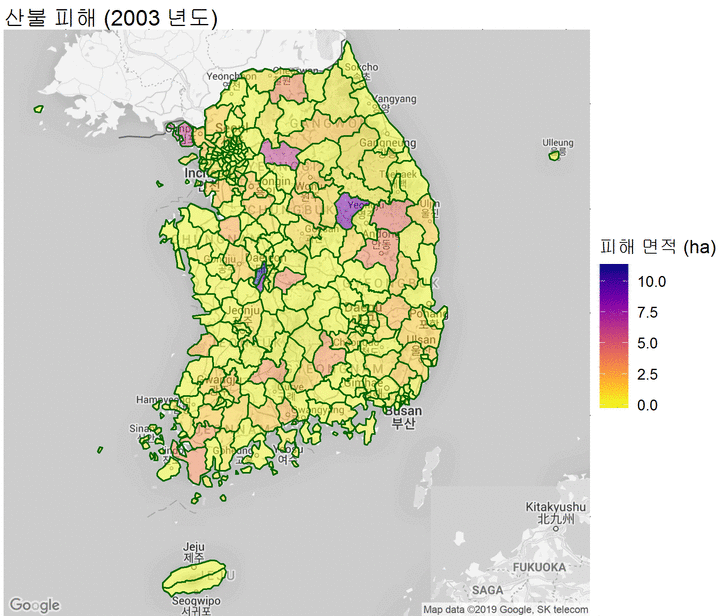

```{r setup, include=FALSE}
knitr::opts_chunk$set(
  echo = FALSE, 
  message = FALSE, 
  warning = FALSE,
  fig.showtext=TRUE
)

eval(parse(here::here('code', 'code_rmd.r'), encoding="UTF-8"))
```

최근 강원도에 발생한 큰 산불로 인해서 몇 가지 궁금증이 생겼다. 남한에 산불은 어떤 패턴으로 일어나나? (모두가 예상하듯이) 지역적 편중이 있을까? 이번 산불처럼 큰 산불은 얼마나 자주 일어날까? 산불을 일으키는 원인은 주로 무엇일까? 

이런 류의 질문에 답하라면 첫째도 데이터, 둘째도 데이터다. 데이터가 없으면 할 수 있는 게 없고, 있어도 여기저기 흩어져 있다면 개 노가다를 해야 하며, 정리된 데이터가 있으면 게으르게 이것저것 살펴볼 수 있다. 한국의 공공 기관에 관해서 여러 가지 불만족을 표현할 수 있겠지만, 그래도 꽤 많은 원자료를 제공하는 편이다. 이 경우도 그렇다. 산림청에서 산불 연감이라는 것을 매년 발표한다. 그리고 해당 연감과 함께 2003년부터 해당 연도 발행일까지의 최신 산불 발생 현황을 비교적 상세하게 엑셀 파일로 제공하고 있다. 요즘은 엑셀 파일만 제공해도 감지덕지다.[^1]

[^1]: 자료를 올린 분이 나름 데이터베이스의 감각을 갖추신 것 같다. 연도, 월, 날짜, 시간을 각각 분리해서 올려두었고, 발생 원인을 앞 글자만 따서 별도의 칼럼을 만들어두었다. 형식적으로 올려야 하니까 올린 것이 아니라 해당 데이터를 직접 활용했다는 이야기다. 

# 월/요일 별 산불 발생  

먼저 몇 가지 기준을 가지고 산불 발생 현황을 시각화해보았다. 

```{r}
tdf0 %>%
  mutate(
    month0 = month(date0) %>% as_factor(),
    weekday = wday(date0, label=T)
  ) %>%
  count(month0, weekday) %>%  # count data with group month, weekday
  draw_calhmap(labelv="건 수", titlev="월/요일 별 산불 발생 (2003~2018)") %>%
  my_fill_theme("건 수", "월/요일 별 산불 (2003 ~ 2018)")
```

```{r}
tdf0 %>%
  filter(damage < 100) %>%
  mutate(
    month0 = month(date0) %>% as_factor(),
    weekday = wday(date0, label=T)
  ) %>%
  group_by(month0, weekday) %>%
  summarise(
    n = sum(damage)
  )  %>% # count data with group month, weekday
  draw_calhmap(damage) %>%
  my_fill_theme("피해면적(ha)", "월/요일 별 산불 (2003 ~ 2018)") 
```

2003년부터 2018년까지 전체 관찰 기간을 합쳐 월별/요일별 발생현황의 상황을 건 별로 그리고 피해 면적 별로 생성했다. 일단 두드러지는 것은 3,4월의 발생 빈도다. 요일 별로는 주말에 산불이 더 나기 쉽지만 요일보다는 발생 월 자체의 영향력이 압도적이다. 3월, 4월은 좋은 꽃놀이의 시기지만, 산불 예방을 위해서 등산객의 활동 범위를 관리 가능한 수준에서 제한하면 어떨까 싶다. 

100 ha 이상의 큰 피해를 남긴 산불의 발생 기록을 살펴봤다. 모두 5월 이전에 발생했으며 1,000 ha 이상의 피해를 남긴 초대형 화재도 두 건이나 존재한다. 

```{r}
tdf0 %>%
  filter(damage >= 100) %>%
  group_by(year(date0), month(date0)) %>%
  summarise(
    damage = sum(damage)
  ) %>% kable(col.names=c('연도', '월', '피해 면적(ha)')) %>% kable_styling()
```

# 발생 건수와 피해 규모 

```{r}
( tdf0 %>%
  group_by(year(date0)) %>%
  summarise(
    n = n(),
    damage = sum(damage)
  ) %>%
  rename(year = `year(date0)`,
         `건수` = n ,
         `피해 면적` = damage
         ) %>%
  pivot_longer(-year, names_to="vars", values_to="values") %>%
  ggplot() +
  aes(x=as_factor(year), y=values) +
  geom_col() + facet_grid(rows = vars(vars), scales="free") ) %>%
  my_fill_theme("", "연도별 발생 건수와 피해 면적")
```

연도별 추이에 경향성이 있나 싶어 봤다. 특별한 경향성이라고 주장할 만한 대목은 보이지 않는다. 

```{r}
gg0 %>% my_pointline() %>% my_color_theme('구분', '건 당 피해 규모 (전체)')
gg1 %>% my_pointline() %>% my_color_theme('구분', '건 당 피해 규모 (100 ha 미만)') 
```

전체 산불에 대해서 살펴보면 중간값과 평균의 차이가 제법 크다. 즉, 일부 소수의 대형 산불이 평균을 끌어올리고 있다. 이런 경향성이 극단값이라고 할만한 대형 산불을 제외해도 비슷한 경향이 존재한다. 

# 발화 원인 

자료에는 화재의 원인도 있다. 보다 상세하게 분류가 되어 있지만 여기서는 다섯 가지로 요약했다. 전체 요약 지표 및 연도별 추이는 아래와 같다. 

```{r}
tdf0a %>%
  group_by(origin_cat) %>%
  summarise(
    n = n(),
    damage0 = sum(damage),
    avg = mean(damage),
    med = median(damage)
  ) %>%
  arrange(desc(damage0)) %>% kable(col.names = c('발화 원인', '건 수', '피해 면적', '평균', '중간값')) %>%
  kable_styling()
```

일단 원인의 파악이 쉽지 않은 경우가 생각 보다 많다. 원인이 파악이 되는 경우 입산자 실화 및 쓰레기 태우기가 많은 부분을 차지한다. 입산자 실화는 그렇다고 쳐도, 쓰레기 소각이 차지하는 비중은 관련 활동에 대한 보다 철저한 지도가 이루어졌으면 한다. 

# 지역별 피해 양상 및 규모  

산불 발생 지역을 보다 자세히 살펴보았다. 산악 지역이 많은 나라다 보니 생각보다 다양한 지역에서 산불이 발생하지만 큰 산불이 일어나는 지역은 확실히 강원도에 편중되어 있다. 만일 산불 예방 본부 같은 걸 만든다면 강원도가 최적이 아닐까 한다. 




```{r}
gen_sf(df_admap, 0) -> df_sf
gen_cpleth(map_bg, df_sf, damage, F, "지역별 산불 피해 (2003~2018)", "피해 면적 (ha)")
```

# Code Description 

[README.md](https://github.com/anarinsk/adp-wild-fire-sk-pub/blob/master/README.md)를 참고하시라. 
